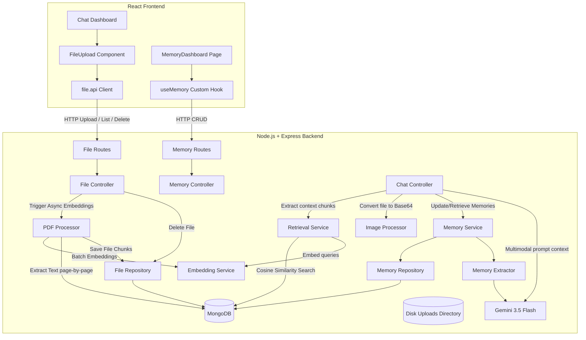

# ChatAI System Documentation

This document covers the Architecture, Database Schema, API Endpoints, Folder Structure, and Setup Instructions for the newly implemented AI Memory System and Multimodal AI File Analysis System.

---

## 1. Architecture Diagram

The application is built using a Clean Architecture design, decoupling concerns into distinct layers (SOLID principles):



### Ingestion Flow:
1. **File Uploading**: The client uploads a file via `POST /api/files/upload`. `multer` validates type/size and writes it to `backend/uploads/`.
2. **Background Processing**:
   - **Images**: Status is marked `completed` immediately. They are parsed dynamically on demand.
   - **PDFs**: A background promise starts text extraction page-by-page using `pdf-parse`. The text is split into chunks (size 800, overlap 150), indexed using Gemini `text-embedding-004` embeddings, and stored in MongoDB.
3. **Query Retrieval**: When sending a message with files, the backend:
   - Queries matching vector chunks using in-memory Cosine Similarity for PDFs, formatting page/source references.
   - Converts images to base64 inline buffers.
   - Generates the LLM prompt combining text, retrieved memory context, semantic PDF chunks, and visual attachments.

---

## 2. Database Schema Documentation

### Memory Schema (`Memory` Collection)
Records key user configurations and preferences.

| Field | Type | Description | Constraints / Default |
| :--- | :--- | :--- | :--- |
| `_id` | `ObjectId` | Auto-generated identifier | Primary Key |
| `userId` | `ObjectId` | Reference to `User` collection | Required, Indexed |
| `key` | `String` | Type of memory (e.g. `profession`, `skills`) | Required, Trimmed |
| `value` | `String` | Actual stored detail value | Required, Trimmed |
| `category` | `String` | Category grouping (profile, career, interests, etc.) | Required, Trimmed |
| `importance` | `Number` | Strength score of memory (1-10) | Default: `5` |
| `createdAt` | `Date` | Timestamp created | Auto-generated |
| `updatedAt` | `Date` | Timestamp modified | Auto-generated |

**Indexes**: Compound unique index on `{ userId: 1, key: 1 }`.

### File Schema (`File` Collection)
Stores upload metadata.

| Field | Type | Description | Constraints / Default |
| :--- | :--- | :--- | :--- |
| `_id` | `ObjectId` | Auto-generated identifier | Primary Key |
| `userId` | `ObjectId` | Reference to `User` collection | Required, Indexed |
| `fileName` | `String` | Original filename | Required, Trimmed |
| `fileType` | `String` | MIME type of file | Required |
| `fileSize` | `Number` | Size of file in bytes | Required |
| `storagePath` | `String` | Local server absolute storage path | Required |
| `processingStatus` | `String` | Chunking status (pending, processing, completed, failed) | Default: `"pending"` |
| `createdAt`/`updatedAt` | `Date` | Timestamps | Auto-generated |

**Indexes**: Single index on `{ userId: 1 }`.

### Chunk Schema (`Chunk` Collection)
Stores vector embeddings and page text of parsed PDF documents.

| Field | Type | Description | Constraints / Default |
| :--- | :--- | :--- | :--- |
| `_id` | `ObjectId` | Auto-generated identifier | Primary Key |
| `fileId` | `ObjectId` | Reference to parent `File` collection | Required, Indexed |
| `userId` | `ObjectId` | Reference to owner `User` collection | Required, Indexed |
| `content` | `String` | Extracted text chunk | Required |
| `pageNumber` | `Number` | The PDF page this chunk belongs to | Optional |
| `embedding` | `[Number]` | Vector representation of content (768 dimensions) | Required |

---

## 3. API Documentation

### File Management Endpoints (`/api/files`)

#### `POST /api/files/upload`
- **Description**: Uploads a PDF or PNG/JPG/WEBP image.
- **Request**: Multipart Form Data (`file: file_buffer`)
- **Headers**: `Authorization: Bearer <token>`
- **Response**:
  ```json
  {
    "success": true,
    "message": "File uploaded successfully.",
    "file": {
      "_id": "648f5e1a123f123456789abc",
      "userId": "648f5e1a123f123456789000",
      "fileName": "Resume.pdf",
      "fileType": "application/pdf",
      "fileSize": 102400,
      "storagePath": "/uploads/file-16854124-pdf",
      "processingStatus": "processing"
    }
  }
  ```

#### `GET /api/files`
- **Description**: Retrieves list of uploaded files for the current user.
- **Headers**: `Authorization: Bearer <token>`
- **Response**:
  ```json
  {
    "success": true,
    "files": [ { ... } ]
  }
  ```

#### `DELETE /api/files/:id`
- **Description**: Permanently deletes file metadata, document text chunks, and physical storage.
- **Headers**: `Authorization: Bearer <token>`
- **Response**:
  ```json
  {
    "success": true,
    "message": "File and indexes deleted successfully."
  }
  ```

---

## 4. Folder Structure Documentation

Below is the directory mapping of the ChatAI project:

```
ChatAI/
├── backend/
│   ├── controllers/
│   │   ├── chat.controller.js              # Integrated memories, base64 images & PDF context
│   │   ├── file.controller.js              # Handles uploads, list & deletion
│   │   └── memory.controller.js            # Handles memory CRUD routes
│   ├── model/
│   │   ├── chunk.model.js                  # Document chunks mongoose schema
│   │   ├── file.model.js                   # Upload files mongoose schema
│   │   ├── message.model.js                # Added files relationship references
│   │   └── memory.model.js                 # Memory items mongoose schema
│   ├── repository/
│   │   ├── file.repository.js              # Database helper for files/chunks
│   │   └── memory.repository.js            # Database helper for memories
│   ├── routes/
│   │   ├── file.routes.js                  # Exposes /api/files endpoints
│   │   └── memory.routes.js                # Exposes /api/memories endpoints
│   ├── services/
│   │   ├── ai.service.js                   # Handles Gemini Vision & PDF context prompts
│   │   ├── embedding.service.js            # Queries text-embedding-004 embeddings
│   │   ├── image.processor.js              # Base64 file converter
│   │   ├── memory.extractor.js             # Extraction system agent
│   │   ├── memory.service.js               # Resolves memory workflow
│   │   ├── pdf.processor.js                # Async page-by-page pdf parser & chunker
│   │   └── retrieval.service.js            # Cosine similarity matching calculator
│   └── src/
│       └── app.js                          # Mounted route pathways
│
└── frontend/
    └── src/
        ├── app/
        │   ├── app.routes.jsx              # Registered memory routes
        │   └── app.store.js                # Integrated memory slice Redux
        ├── chat/
        │   └── pages/
        │       └── Dashboard.jsx           # File upload overlays & attachment history mapping
        └── features/
            ├── files/
            │   ├── components/
            │   │   └── FileUpload.jsx      # Drag & Drop upload component
            │   ├── service/
            │   │   └── file.api.js         # Fetch client wrappers
            │   └── styles/
            │       └── fileUpload.css      # Upload UI responsive stylesheet
            └── memory/
                ├── hook/
                │   └── useMemory.js        # Memory hook
                └── pages/
                    └── MemoryDashboard.jsx # Custom memory listing page
```

---

## 5. Setup Guide

### 1. Backend Ingestion:
Ensure your `.env` contains:
```env
MONGO_URI=mongodb+srv://...
GOOGLE_API_KEY=AIzaSy...
JWT_SECRET=...
```

Run installation:
```bash
cd backend
npm install
npm run dev
```

### 2. Frontend Launch:
```bash
cd ../frontend
npm install
npm run dev
```

Files are automatically saved in the root `backend/uploads` directory. PDF files undergo chunking immediately, while images are loaded on the fly upon chat requests.
